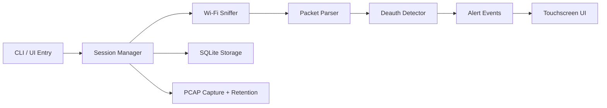
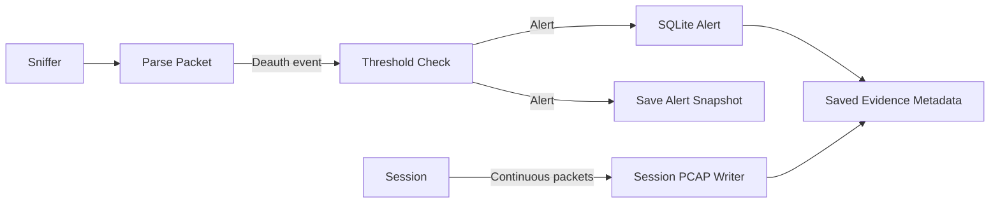

# PWD-Box
Portable Wireless Defence Box for passive Wi-Fi deauthentication monitoring on Raspberry Pi.

PWD-Box is a passive-only wireless watchdog. It listens to 802.11 management traffic, detects suspicious deauthentication floods, shows alerts on a touchscreen UI, and stores local evidence for later review.

## Demo


*Suggested clip: start monitoring, dashboard status updates, evidence recording active.*


*Suggested clip: alert banner appears, alert count updates, session evidence is saved.*


*Suggested clip: setup flow, diagnostics screen, health check passing.*

## Why This Exists

Wi-Fi deauthentication abuse is disruptive and easy to miss without visibility into management traffic. PWD-Box is designed as a small, self-contained, passive device that helps an operator:

- observe nearby Wi-Fi activity safely
- detect deauthentication floods conservatively
- retain session and alert evidence locally
- operate the system from a simple touchscreen UI

## Safety Boundary

PWD-Box is passive-only.

It does:

- monitor Wi-Fi management traffic
- detect likely deauthentication flood conditions
- store sessions, alerts, snapshots, and PCAP evidence locally

It does not:

- inject packets
- jam networks
- deauthenticate clients
- associate to networks for active probing
- send telemetry to a cloud backend

Use it only where you have permission to monitor wireless traffic.

## Current Capabilities

- health checks for Python, tools, permissions, and adapter readiness
- monitor-mode validation and capture startup checks
- passive AP observation and network snapshot logging
- 802.11 management-frame parsing
- deauthentication flood detection with a sliding threshold window
- real-time touchscreen alerts and session status
- SQLite persistence for sessions, alerts, snapshots, and settings
- session-wide PCAP capture while monitoring is running
- short alert-centered PCAP snapshots from the rolling buffer
- evidence retention controls for file count and total size

## Reference Build

PWD-Box currently targets Raspberry Pi-class hardware.

Recommended hardware:

- Raspberry Pi 3B+ or Raspberry Pi 4
- monitor-mode capable USB Wi-Fi adapter
- 5-7 inch touchscreen
- microSD card with at least 8 GB
- optional INA219 battery sensor

## Quick Start

### 1. Create a virtual environment

```bash
python3 -m venv .venv
source .venv/bin/activate
pip install -r requirements.txt
```

### 2. Run a health check

Replace `wlan1` with the interface you intend to use.

```bash
sudo env PYTHONPATH=. .venv/bin/python -m src.main health-check --interface wlan1
```

### 3. Start passive monitoring

```bash
sudo env PYTHONPATH=. .venv/bin/python -m src.main monitor --interface wlan1
```

### 4. Start the touchscreen UI

```bash
sudo env PYTHONPATH=. .venv/bin/python -m src.ui
```

### 5. Run the demo UI smoke test

```bash
PYTHONPATH=. .venv/bin/python scripts/ui_smoke_test.py
```

## Operator Workflow

Typical use:

1. power on the device
2. open the UI
3. complete setup if needed
4. select or confirm the wireless interface
5. run diagnostics / health check
6. press Start monitoring
7. watch the dashboard for live status and alerts
8. press Stop to finalize the session PCAP

## Project Structure

```text
src/
    main.py                 CLI entry point
    health.py               device and environment checks
    config.py               config loading
    models.py               shared dataclasses

    capture/
        wifi_sniffer.py       packet capture
        packet_parser.py      802.11 parsing

    detection/
        deauth_detector.py    deauth threshold logic

    orchestration/
        session_manager.py    monitoring lifecycle

    evidence/
        pcap.py               session and alert PCAP handling

    storage/
        db.py                 SQLite persistence

    ui/
        app.py                Kivy app
        controller.py         background monitor control
        screens/              dashboard, alerts, settings, diagnostics
```

## Architecture



## Data Flow



## Evidence and Storage

Runtime data is stored inside the project under the `data/` directory.

- SQLite database: `data/db/pwd_box.sqlite`
- session PCAP files: `data/pcaps/`
- alert PCAP snapshots: `data/pcaps/`

Evidence behavior:

- when monitoring starts, a new session PCAP file is opened
- packets are written while monitoring runs
- when monitoring stops, the session PCAP is finalized cleanly
- when an alert triggers, a short alert-centered PCAP snapshot is also saved
- retention limits bound PCAP count and total disk usage

## Configuration

Default configuration lives in `config/default.yaml`.

Important settings include:

- capture interface
- deauth threshold and time window
- AP stale timeout
- evidence retention limits
- storage locations

Keep thresholds conservative. The goal is detection with low operator confusion, not aggressive triggering.

## Testing

Run all tests:

```bash
pytest -q
```

Run focused tests:

```bash
pytest tests/test_packet_parser.py -q
pytest tests/test_deauth_detector.py::test_threshold_triggers_alert -q
pytest tests/test_onboarding.py -q
```

## Troubleshooting

### Permissions
Monitoring usually requires elevated privileges on Linux.

Use `sudo`, or configure the necessary capabilities for packet capture.

### Adapter support
Your Wi-Fi adapter must support monitor mode.

Monitor mode must be enabled manually before starting PWD-Box:

```bash
sudo ip link set wlan1 down
sudo iw dev wlan1 set type monitor
sudo ip link set wlan1 up
```

Replace `wlan1` with your actual interface name. Verify it worked with:

```bash
iw dev wlan1 info
```

The output should show `type monitor`.

### Kivy dependencies
If Kivy fails to install on Raspberry Pi OS, install the necessary graphics build dependencies first.

### Storage checks
The health check validates that required storage directories can be created and used before a monitoring session begins.

## Objective to Implementation Mapping

| Objective | Implementation Area |
| --- | --- |
| Passive monitoring | `src/capture/wifi_sniffer.py`, `src/orchestration/session_manager.py` |
| Packet parsing | `src/capture/packet_parser.py` |
| Deauth detection | `src/detection/deauth_detector.py` |
| Local persistence | `src/storage/db.py` |
| Evidence capture | `src/evidence/pcap.py` |
| Touchscreen operation | `src/ui/app.py`, `src/ui/screens/` |
| Device checks | `src/health.py` |

## Suggested Media Checklist

If you want the README to feel complete, record these clips:

- startup and health-check pass
- dashboard during active monitoring
- alert trigger and alert history update
- evidence/session save confirmation
- diagnostics or onboarding flow

Keep each GIF under about 10 seconds and crop tightly around the UI so the motion reads quickly on GitHub.

## Status

PWD-Box is a prototype with working passive monitoring, local evidence capture, and an operator-facing UI. The design goal is a small, safe, local-first monitoring device rather than a general wireless attack toolkit.
