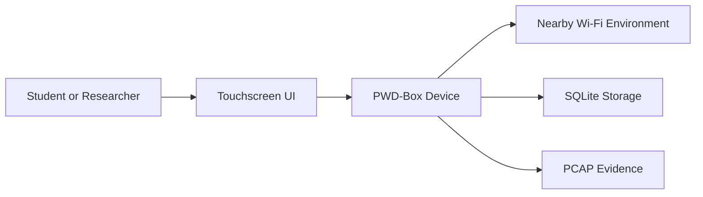
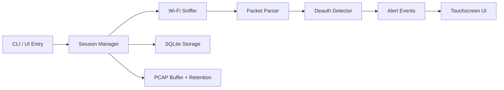
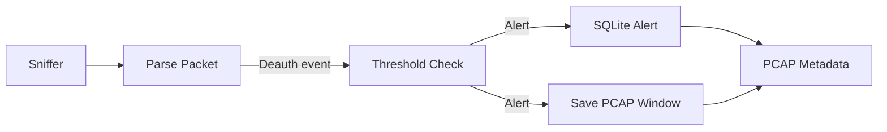

# Phase 1 Requirements and Foundations

## Purpose
Phase 1 defines the system requirements, boundaries, and foundational design for PWD-Box before extended development.

## Scope
In scope:
- Passive-only Wi-Fi monitoring of 802.11 management traffic
- Deauthentication flood detection with conservative thresholds
- Touchscreen UI for live status and alerts
- Local evidence storage (SQLite + PCAP windows)
- On-device configuration for interface, retention, and diagnostics

Out of scope:
- Packet injection, jamming, or offensive activity
- Bluetooth monitoring
- Active network scanning or association
- Cloud backends or remote telemetry

## System Requirements
Functional requirements:
- FR1: Capture Wi-Fi management frames in monitor mode without transmitting.
- FR2: Detect deauthentication floods using a sliding time window and threshold.
- FR3: Present real-time alerts on a touchscreen UI.
- FR4: Store sessions, alerts, and network snapshots in SQLite.
- FR5: Capture alert-centered PCAP evidence with retention limits.
- FR6: Provide on-device settings for interface, evidence limits, and diagnostics.

Non-functional requirements:
- NFR1: Operate safely and passively only.
- NFR2: Run on Raspberry Pi-class hardware with limited CPU and memory.
- NFR3: Use open-source libraries for capture and UI.
- NFR4: Provide a clear, low-jargon operator experience.
- NFR5: Keep evidence storage bounded by time and size.

## Assumptions
- A monitor-mode capable Wi-Fi adapter is available.
- The device runs Linux with required permissions (sudo or capabilities).
- Storage is local and persistent across reboots.

## Constraints
- Passive-only operation.
- No packet injection or active deauth tooling.
- Prefer lightweight dependencies and minimal services.

## Success Criteria
- SC1: A deauth flood crossing the configured threshold triggers an alert in the UI.
- SC2: Alerts are persisted to SQLite with session context.
- SC3: A short PCAP window is saved on alert and pruned by retention limits.
- SC4: A non-expert can start monitoring from the dashboard with minimal setup.

## Related Work Summary
Passive monitoring of 802.11 management frames is a common approach for safe detection of deauthentication floods. Research and practitioner guidance typically recommend sliding window thresholds to reduce false positives, and storing evidence windows around alert events to support later review without long-term packet capture. PWD-Box follows that conservative, passive pattern and avoids active interference.

## Foundational Diagrams

### System Context

### Component Architecture

### Data Flow

## Objective-to-Implementation Traceability
| Objective | Requirement(s) | Implementation | Tests |
| --- | --- | --- | --- |
| Passive monitoring device | FR1, NFR1 | src/capture/wifi_sniffer.py, src/orchestration/session_manager.py | tests/test_packet_parser.py |
| Deauth detection | FR2 | src/detection/deauth_detector.py, src/capture/packet_parser.py | tests/test_deauth_detector.py |
| Real-time alerts in UI | FR3 | src/ui/app.py, src/ui/screens/alerts.py, src/ui/screens/dashboard.py | scripts/ui_smoke_test.py |
| Evidence storage and review | FR4, FR5, NFR5 | src/storage/db.py, src/evidence/pcap.py, src/ui/screens/alerts.py | tests/test_packet_parser.py |
| Ease of operation | FR6, NFR4 | src/ui/screens/settings.py, src/ui/screens/setup.py, src/ui/screens/diagnostics.py | tests/test_onboarding.py |
| Affordable hardware target | NFR2 | README.md, src/health.py, src/battery_factory.py | tests/test_battery.py |
| Open-source tooling | NFR3 | requirements.txt, src/capture/packet_parser.py, src/ui/app.py | tests/test_onboarding.py |
